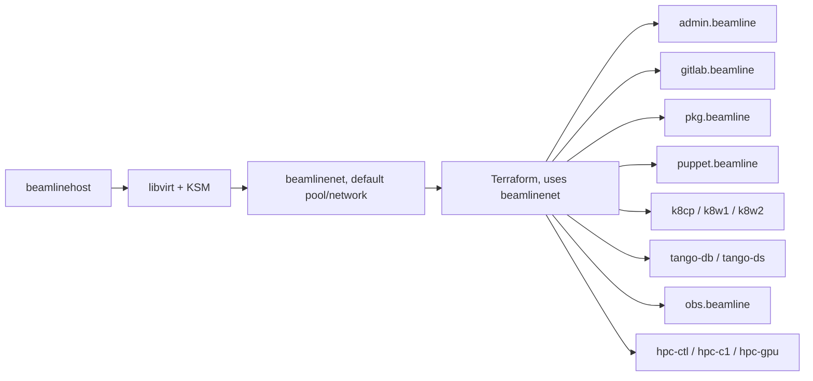

# beamlinehost — Disaster Recovery Runbook

**Read this first.** This document assumes `beamlinehost` is gone — hardware failure, OS reinstall, new hardware, whatever the cause — and you're starting from nothing. It is deliberately **self-contained**: every file needed is embedded below in full, not referenced from another chapter or cloned from anywhere. The projects' git history lives on GitHub (`github.com/falaksherpk`), which is off-host and normally survives the loss of `beamlinehost`, and Section 4 reconnects to it. The files stay embedded anyway, so a rebuild still works if GitHub or the account is unreachable. (Until 2026-10 the history lived on `gitlab.beamline`, a VM hosted by `beamlinehost` itself, so cloning from it during a recovery was impossible by design.) This runbook is the one artifact that has to work without assuming anything else in this project still exists.

**Keep a copy of this file somewhere that isn't `beamlinehost` itself** — a second machine, a USB drive, printed out, doesn't matter. A disaster-recovery document that only lives on the machine it's recovering is not a disaster-recovery document.

Everything in this document runs **on `beamlinehost` itself**, except the final fleet-connectivity check in Section 3, which runs *from* `beamlinehost` *to* each VM (shown explicitly there). Only the Ubuntu installer and the "Install SSH access" step near the start of Section 1 have to be done at the physical console or via out-of-band remote access (IPMI/KVM) — nothing provides SSH access to `beamlinehost` before that step runs. Once it's done, everything else — the rest of Section 1 and all of Sections 2-4 — can be run either from a remote terminal (MobaXterm, or any SSH client) or by staying at the physical desktop, whichever you have available.

---

### Document info

| | |
|---|---|
| Last validated | 2026-08-05, live end-to-end disaster-recovery test: genuine bare-metal Ubuntu install through the fleet, not just a running system checked after the fact 2026-10-04, live rebuild: all five Section 1 checkpoint items passed (including the v1.2 color-prompt line and `ansible hypervisor -m ping`), the versions table below was re-checked against the installed packages, and Section 3 completed end to end with every checkpoint item passing, including the v1.1 control-node step (12/12 passwordless SSH by IP from `admin.beamline`), the by-name fleet check (13/13), `./tf.sh plan` reporting `No changes`, and `ansible-playbook site.yml --check --diff` reporting `changed=0`; all 20 files embedded in Sections 1-3 were confirmed byte-identical to the live ones, and Section 4's checkpoint passed: both projects show a clean `git status` against `main` on GitHub (`beamlinehost-ansible` at `b613cbc`, `beamline-terraform` at `0df1cf8`). The v1.5 `tf.sh`/`TMPDIR` change also passed a host-reboot test the same day (see the Troubleshooting entry on reboot drift) |
| Revision history | v1.5 — Section 3's reboot-drift fix changed. The `staging_directory` attribute and `cloudinit_staging_dir` variable are removed: the attribute is not in the released provider (v0.9.9; proposed upstream as issue #1368 / PR #1369) and `terraform validate` rejects it with `Unsupported argument`. Replaced by a project-local `tf.sh` wrapper that exports `TMPDIR` to a gitignored `.tmp/`; every Terraform command in Section 3 now runs through `./tf.sh`. Also corrected the `/tmp` description: it is emptied at boot (by systemd-tmpfiles on this host, where `/tmp` is ext4, not tmpfs). Also brought two stale 10-VM references in the Troubleshooting appendix up to the current 13-VM fleet and annotated the drift counts there with how they scale. Added the three HPC nodes (`hpc-ctl`, `hpc-c1`, `hpc-gpu`) to the embedded `hosts.j2`, which had only the original 10 VMs: Section 3's by-name SSH check includes the HPC names, so on a rebuild from this runbook alone those three checks would have failed with a name-resolution error. Confirmed and fixed live on 2026-10-04 (13 entries in `/etc/hosts` after `ansible-playbook site.yml`, all three names resolving), and the Section 2 `getent` check now includes `hpc-gpu.beamline`. Replaced the embedded `providers.tf` and `variables.tf` with the live files' `terraform fmt`-canonical text (the old blocks were hand-aligned and differed from the live files in whitespace only, confirmed with `diff -w`), so all 19 embedded files in Sections 1-3 are now byte-identical to the live ones on beamlinehost. Section 4 rewritten for GitHub (`github.com/falaksherpk`) instead of `gitlab.beamline`: a dedicated key, `~/.ssh/config`, host-key verification, git identity, and attaching both projects to their history with a plain `git reset`, all done live on 2026-10-04. Section 2 now embeds the GitHub versions of `ansible.cfg` (SSH multiplexing and keepalive), the `common` tasks (`shellcheck`) and the `hypervisor` tasks (`check_mode: false` on the three `command` tasks, so `--check` runs them too), plus the project's `.gitignore`, moved here from Section 4. Section 3's `variables.tf` description no longer claims a GPU hostdev in `main.tf`, since neither copy had one. The intro's self-containment rationale and the dependency diagram (now including the three HPC nodes) were updated to match. The "10 domains" timing in the Estimated timings section is deliberately unchanged: it is a measurement from the 2026-08-05 test, which ran against the 10-VM fleet. v1.3 — renamed this runbook's own four divisions from "Part" to "Section" throughout (headings, checkpoints, and all internal cross-references), removed all outward references to other documents so this runbook stands entirely on its own, and moved the version designation into the filename. No procedural content changed. v1.2 — added a `sed`-based color-prompt enable to Section 1, right after the hostname is set and before `exec bash` (which now also picks up the `.bashrc` change), matching what `beamlinehost-ansible`'s own `common` role applies declaratively in Section 2. v1.1 — added "Establish the control node (`admin.beamline`)" to Section 3: copies the fleet private key to `admin.beamline` as `~/.ssh/id_ed25519` and verifies passwordless SSH from `admin.beamline` to the other nine VMs by IP. Without it, a rebuild driven solely by this runbook leaves `admin.beamline` unable to act as the fleet's Ansible control node, and the first fleet-wide `ansible all -m ping` run from it would fail at the very first connection attempt. v1.0 — initial disaster-recovery runbook, written after bringing `beamlinehost` under real configuration management for the first time (until then, everything here had only ever been a hand-run set of commands, never idempotent or re-runnable) |

### Validated against these versions

**Why this matters:** every gotcha documented inline in this runbook (`qemu-kvm` vs `qemu-system-x86`, the `community.general`/`community.libvirt` split) was version-specific when discovered.
**Evidence:** both of those have already changed once during this project's own lifetime — real precedent, not a hypothetical risk.
**What this means for a future rebuild:** if it's on a newer Ubuntu release than the table below, treat every inline gotcha as "needs re-checking," not as permanently settled fact.

| Component | Version confirmed |
|---|---|
| Ubuntu | 24.04.5 LTS (Noble Numbat), kernel `7.0.0-38-generic` (confirmed 2026-10-04; the 2026-08-05 validation ran on kernel `7.0.0-28-generic`) |
| `ansible` (the metapackage — what actually determines bundled collection versions) | `9.2.0+dfsg-0ubuntu5` |
| `ansible-core` | `2.16.3-0ubuntu2` |
| `community.general` collection | 8.3.0 — what a fresh `apt install ansible` gives you on Ubuntu 24.04; not pinned by any step in this runbook, just what ships by default and correctly matches `ansible-core 2.16.3` (see the Troubleshooting appendix for what goes wrong if this ever gets force-upgraded) |
| `community.libvirt` collection | 1.3.0 (bundled with the `ansible` package, no separate install — confirmed directly on a fresh Ubuntu 24.04 install, 2026-08-05; this is genuinely older than Galaxy's latest release, since Ubuntu's `ansible` metapackage bundles whatever was current when it was built, not the newest available) |
| `qemu-system-x86` | 1:8.2.2+ds-0ubuntu1.18 (confirmed 2026-10-04; 1.17 at the 2026-08-05 validation) |
| `libvirt` (daemon/client) | 10.0.0-2ubuntu8.x (`libvirt-daemon-system` 10.0.0-2ubuntu8.19 confirmed 2026-10-04) |
| Terraform | via HashiCorp's own apt repo, latest at install time |
| `dmacvicar/libvirt` Terraform provider | >= 0.9.0 (v0.9.9, with Terraform v1.16.5, confirmed on the 2026-10-04 rebuild) |

### Prerequisites

Confirm every one of these before starting Section 1:

| Requirement | Needed |
|---|---|
| Hardware virtualization enabled in BIOS/UEFI (VT-x/AMD-V) | Yes — Section 2's `virt-host-validate` task will catch this if missed, but confirming beforehand saves a failed run |
| Internet connection reachable from `beamlinehost` | Yes — apt packages, the Ubuntu cloud image, the HashiCorp repo, and the Ansible Galaxy collections all need it |
| Ubuntu Desktop 24.04 LTS installer media | Yes |
| A copy of this runbook, stored somewhere other than `beamlinehost` | Yes — see the warning above; this is the one document that has to survive the disaster |
| Physical or out-of-band (IPMI/KVM) access to the machine | Yes, until Section 1's SSH step completes |
| Free disk space: at least ~300 GB (recommendation) | See "Disk and memory requirements" below for the measured number this is based on |
| Physical RAM: 32 GB or more (recommendation) | Same — see below |

### Estimated timings

Rough, hardware-dependent ranges — not measured on any specific machine, and not a guarantee. The single biggest factor is disk speed (SSD vs. spinning HDD) and internet bandwidth for the download-heavy steps; CPU speed matters less than either of those for most of this list. If a step takes noticeably longer than its upper bound, that's worth investigating rather than assuming it's just slow — check the Troubleshooting appendix.

| Step | Typical range | Depends most on |
|---|---|---|
| Ubuntu Desktop install (Section 1) | 15-30 min | Disk speed, whether from USB 2.0 vs 3.0 media |
| `apt full-upgrade` + reboot (Section 1) | 5-20 min | Internet bandwidth, how out-of-date the ISO is |
| Ansible bootstrap + role run (Section 2) | 3-10 min | Internet bandwidth (package downloads), disk speed |
| Base cloud image + checksum download (Section 3) | 1-5 min | Internet bandwidth |
| `terraform apply`, all 13 VMs (Section 3) | 5-20 min | Disk speed (COW overlay creation), CPU (13 simultaneous boots) |
| Cloud-init completing inside each VM (Section 3) | 2-5 min after `apply` finishes | Same as above, plus whatever each VM's own `packages:`/`growpart` step needs |

**Total, realistically: 30 minutes to just over an hour** for a from-scratch rebuild through the fleet being reachable (end of Section 3), on reasonably modern hardware (SSD, wired ethernet). Meaningfully slower on a spinning disk or a slow/metered connection — budget more time rather than assume something's broken.

**Real data point, from this runbook's own first live end-to-end test (2026-08-05):** `hostnamectl set-hostname` through `apt full-upgrade` + reboot + reconnect measured at 14 minutes 34 seconds, cleanly timestamped. `terraform apply` for all 10 domains completed in under a minute, 11-14 seconds per domain. Total wall-clock time across the whole test was closer to 2.5-3 hours — but that figure includes live debugging of two real bugs (the `community.libvirt` autostart issue, a directory-context mistake while building a role file) and isn't representative of the runbook's own inherent execution time; the estimates above remain the better guide for a straightforward run with no surprises.

### Disk and memory requirements, calculated exactly from the real fleet definition

**Measured** — these numbers come directly from `variables.tf` (Section 3), summed across all 13 VMs, not estimated:

| | Total |
|---|---|
| Sum of every VM's declared `disk_gb` | 350 GB |
| Sum of every VM's baseline `memory` | 34,816 MiB (~34 GiB) |
| Sum of every VM's `virtio_mem` ceiling (13 × 2048 MiB) | 26,624 MiB (~26 GiB) — headroom, not committed |

**Recommendation — disk:** budget ~370 GB total (the 350 GB above, plus ~1 GB for the base cloud image and ~6 GB for the Ubuntu Desktop installer ISO). Caveat on the 350 GB itself: it's each VM's *declared maximum capacity*, not real usage — every VM's disk is a copy-on-write overlay backed by one shared base image, so actual space consumed grows only as each VM's filesystem genuinely fills up, typically far less than 350 GB combined on a freshly-rebuilt fleet. Budget for the full number anyway; don't rely on the overlay behavior to under-provision.

**Recommendation — memory:** with the fleet now at 13 VMs, the summed baseline `memory` is **~34 GiB — which exceeds 32 GB of physical RAM outright.** This is only viable because guest RAM is allocated on demand (a VM at its 2048 MiB baseline rarely touches all of it at idle) and because KSM deduplicates the large amount of identical content across VMs booted from one base image — but the margin that existed at 10 VMs (~26 GiB baseline against 32 GB) is now gone. **32 GB is the hard floor and is genuinely tight at 13 VMs; 48–64 GB is the honest recommendation if the fleet stays at this size or grows.** Basis for the pressure being real, not theoretical: this project hit genuine memory pressure back at the *10-VM* scale already (VMs sharing one base image built up real, non-reclaimable page cache; KSM was enabled but scanning too slowly by default to deduplicate it in time — see the Troubleshooting appendix); the three HPC nodes added since only tighten it further. The `virtio_mem` ceiling exists specifically to let VMs burst *temporarily* into remaining headroom rather than being permanently over-provisioned for a worst case that's rare in practice.

### How the pieces depend on each other


Recovery order follows this chain left to right — nothing on the right can come up until everything to its left is working. This runbook covers everything through `beamlinenet` and the 13 VMs existing and reachable; configuring what runs *inside* each VM (Kubernetes, Tango, SLURM) is out of scope here (Section 4).

---

## Section 1 — Ubuntu Desktop 24.04, minimal install

**Checkpoint — before starting:** every item in the Prerequisites table above is confirmed.

Install Ubuntu Desktop 24.04 LTS from official media (`ubuntu.com/download/desktop`), verifying the ISO checksum before use.

During installation:
- **Application selection:** choose **"Default selection"** (minimal — desktop essentials and a browser only) or **"Extended selection"** (adds LibreOffice, Thunderbird, media apps) based on whether you actually use this machine for email/office work day-to-day, not on its role as a hypervisor — `beamlinehost` runs a real, active GUI session (confirmed via `gnome-remote-desktop-daemon`, `evolution-alarm-notify` running during normal use), so this is a genuine desktop, not a headless server pretending to have a desktop installed.
- **Third-party software:** do **not** enable it — keeps the base install minimal and avoids pulling in codecs/drivers this project doesn't need.
- **User account:** username `falak` (matches every path and command in this runbook — using a different username means adjusting every `/home/falak/...` reference below).
- **Computer name:** `beamlinehost` if you want it set correctly immediately — but this doesn't actually matter either way, since the next step sets it unconditionally regardless of what's chosen here.
- Everything else: accept defaults unless your hardware needs specific partitioning.

Set the hostname explicitly right after first login — unconditionally, whether or not the installer's screen already set it correctly, the same declare-it-outright approach used everywhere else in this runbook rather than checking first and only fixing if wrong:
```bash
sudo hostnamectl set-hostname beamlinehost
```
Running this even when it's already correct is a genuine no-op, not wasted effort — same idempotency principle as every Ansible task in this document.

```bash
hostname
```
Expect exactly `beamlinehost` — this works immediately, no refresh needed, since `hostname` queries the running kernel directly rather than anything cached by the shell. Only your **prompt's own display** lags behind, purely cosmetic.

While `~/.bashrc` is on your mind, enable the colored prompt too — Ubuntu ships it commented out by default, and it's the fastest way to tell ten near-identical terminal sessions apart later:
```bash
sed -i 's/^#force_color_prompt=yes/force_color_prompt=yes/' ~/.bashrc
```
This is the manual, one-time version of the same setting `beamlinehost-ansible`'s `common` role (Section 2, below) applies declaratively via `lineinfile` — doing it here just means you don't have to wait for the Ansible run to stop squinting at unlabeled prompts.

```bash
exec bash
```
Replaces the current shell in place with a fresh one that re-reads both the hostname and `~/.bashrc` — the prompt updates immediately, no new terminal window or logout/login needed.

### Install SSH access

The only thing done at the physical machine, after the installer finishes — Ubuntu Desktop doesn't ship with `sshd` installed by default:
```bash
sudo apt install -y openssh-server
sudo systemctl enable --now ssh
ip a | grep "inet "
```
Note the IP address shown, then connect from another machine:
```bash
ssh falak@<beamlinehost-ip>
```
From this point on, everything else in this runbook — the rest of Section 1, and all of Sections 2-4 — runs from this remote SSH session (MobaXterm or any SSH client), or by continuing at the physical desktop directly if you prefer. Both work identically.

The `common` Ansible role (Section 2) also declares `openssh-server` as a task — that's intentional, not a duplicate to clean up later. Declaring it there means a future `ansible-playbook` run still guarantees it's present even if this manual step is ever skipped; installing it here just means you don't have to wait until Section 2 to stop typing at a physical keyboard.

### Update the base system

```bash
sudo apt update && sudo apt full-upgrade -y
sudo reboot
```
This drops the current SSH session (the machine is rebooting) — reconnect once it's back up:
```bash
ssh falak@<beamlinehost-ip>
```

### Install Ansible

```bash
sudo apt install -y ansible
ansible --version
```
Confirm it reports `ansible [core 2.16.3]` or similar — Ubuntu 24.04's own repos carry a recent-enough version, no PPA or pip needed.

```bash
mkdir -p ~/beamlinehost-ansible/inventory
cd ~/beamlinehost-ansible
```

```bash
cat > ansible.cfg << 'EOF'
[defaults]
inventory = inventory/inventory.ini
host_key_checking = False
retry_files_enabled = False

[privilege_escalation]
become = True
become_method = sudo
become_ask_pass = True

[ssh_connection]
ssh_args = -o ControlMaster=auto -o ControlPersist=60s -o ServerAliveInterval=5 -o ServerAliveCountMax=3
EOF
```

```bash
cat > inventory/inventory.ini << 'EOF'
[hypervisor]
beamlinehost ansible_connection=local
EOF
```

Confirm the local connection actually works before building anything on top of it:
```bash
ansible hypervisor -m ping
```
Expect `beamlinehost | SUCCESS => {"ping": "pong"}`.

### Checkpoint — end of Section 1

- [ ] `hostname` prints exactly `beamlinehost`
- [ ] Prompt is colored; `grep force_color_prompt ~/.bashrc` shows the line uncommented
- [ ] `ssh falak@<beamlinehost-ip>` connects successfully
- [ ] `ansible --version` reports `ansible [core 2.16.3]` or similar
- [ ] `ansible hypervisor -m ping` returns `SUCCESS`

If any of these fail, don't proceed to Section 2 — the rest of this runbook assumes all five work.

---

## Section 2 — Recreate the `beamlinehost-ansible` project

```bash
mkdir -p ~/beamlinehost-ansible/roles
cd ~/beamlinehost-ansible
ansible-galaxy role init roles/common
ansible-galaxy role init roles/hypervisor
ansible-galaxy role init roles/terraform
```

**Stay in `~/beamlinehost-ansible` for everything below.** Every `cat > roles/...` command from here on is a relative path — if you navigate elsewhere between steps (checking something in another terminal tab, coming back after a break) and don't `cd` back first, the command either fails outright (`No such file or directory`) or, worse, silently writes the file to the wrong place. Confirmed live: this happened during this exact section on the first real test of this runbook. If a `cat >` command ever fails with that error, run `cd ~/beamlinehost-ansible` and retry it — don't just retype the command hoping it works.

### `roles/common/defaults/main.yml`

```bash
cat > roles/common/defaults/main.yml << 'EOF'
#SPDX-License-Identifier: MIT-0
---
hypervisor_user: falak
EOF
```

### `roles/common/tasks/main.yml`

```bash
cat > roles/common/tasks/main.yml << 'EOF'
#SPDX-License-Identifier: MIT-0
---
# tasks file for common
#
# beamlinehost's own baseline — same tools, timezone, and time-sync approach
# as the fleet's common role (lab-ansible/roles/common), since the same
# justifications apply here: admin/debugging toolkit, and chrony/Etc/UTC
# matter especially on this host, since every VM's own chrony ultimately
# traces its time back to whatever this machine's clock actually is.
#
# ufw is installed but deliberately NOT enabled here — unlike the fleet's
# common role, which enables default-deny immediately. This is a Desktop
# machine in active daily use (GUI session, remote desktop access per
# project notes); enabling default-deny blind risks locking out something
# currently relied on. Revisit only after auditing what's actually in use
# (`ss -tlnp`, active remote-desktop/VNC ports, etc.) and writing explicit
# allow rules for what's genuinely needed — not before.

- name: Set timezone to Etc/UTC
  community.general.timezone:
    name: Etc/UTC

- name: Ensure baseline packages are installed
  ansible.builtin.apt:
    name:
      # Time sync and firewall
      - chrony
      - ufw
      # Needed to add external apt repos (e.g. HashiCorp's, for Terraform)
      - curl
      - gnupg2
      - ca-certificates
      # Remote access
      - openssh-server
      # Admin/debugging toolkit
      - htop
      - vim
      - git
      - tree
      - wget
      - dnsutils
      - bash-completion
      - jq
      - shellcheck
    state: present
    update_cache: true

- name: Ensure chrony (NTP) is running and enabled
  ansible.builtin.service:
    name: chrony
    state: started
    enabled: true

- name: Deploy /etc/hosts with the VM fleet roster
  ansible.builtin.template:
    src: hosts.j2
    dest: /etc/hosts
    owner: root
    group: root
    mode: "0644"

- name: Enable color prompt in .bashrc
  ansible.builtin.lineinfile:
    path: "/home/{{ hypervisor_user }}/.bashrc"
    regexp: '^#force_color_prompt=yes'
    line: force_color_prompt=yes
  become: false
EOF
```

### `roles/common/templates/hosts.j2`

```bash
cat > roles/common/templates/hosts.j2 << 'EOF'
127.0.0.1       localhost
::1             localhost ip6-localhost ip6-loopback

# beamline VM fleet
10.10.10.11     admin.beamline
10.10.10.12     gitlab.beamline
10.10.10.13     pkg.beamline
10.10.10.14     puppet.beamline
10.10.10.21     k8cp.beamline
10.10.10.22     k8w1.beamline
10.10.10.23     k8w2.beamline
10.10.10.31     tango-db.beamline
10.10.10.32     tango-ds.beamline
10.10.10.41     obs.beamline
10.10.10.51     hpc-ctl.beamline
10.10.10.52     hpc-c1.beamline
10.10.10.53     hpc-gpu.beamline
EOF
```

### `roles/hypervisor/defaults/main.yml`

```bash
cat > roles/hypervisor/defaults/main.yml << 'EOF'
#SPDX-License-Identifier: MIT-0
---
hypervisor_user: falak
EOF
```

### `roles/hypervisor/tasks/main.yml`

```bash
cat > roles/hypervisor/tasks/main.yml << 'EOF'
#SPDX-License-Identifier: MIT-0
---
# tasks file for hypervisor
#
# What actually makes beamlinehost function as this fleet's hypervisor.
# Idempotent and re-runnable via `ansible-playbook site.yml`. Terraform is
# deliberately NOT here -- see roles/terraform: this role covers only what
# makes the host capable of running VMs at all.
#
# Pool/network XML lives in templates/, not inline -- easier to read/diff.
#
# virt-host-validate: checks stdout AND stderr for a literal FAIL line,
# not the exit code -- WARN-level checks also exit non-zero (see appendix).
#
# NOTE: qemu-system-x86 is correct; qemu-kvm does not exist on Ubuntu 24.04
# (see Troubleshooting appendix). Do not "fix" this back to qemu-kvm.
#
# NOTE: libvirtd is Ubuntu 24.04's only option -- no virtqemud/virtnetworkd/
# virtstoraged binaries, packages, or units exist on this release at all
# (confirmed directly: which/dpkg -L/apt-cache search/systemctl list-unit-files
# all empty). Its "changed" flapping under --check is expected: it runs with
# --timeout 120 and genuinely exits when idle, respawned by its sockets on
# demand (see Troubleshooting appendix). Not a fault, no fix needed.

- name: Ensure KVM/libvirt packages are installed
  ansible.builtin.apt:
    name:
      - qemu-system-x86
      - qemu-utils
      - libvirt-daemon-system
      - libvirt-clients
      - virtinst
      - virt-manager
      - libguestfs-tools
      - genisoimage
      - python3-libvirt
      - python3-lxml
      - ksmtuned
    state: present
    update_cache: true

- name: Ensure the libvirtd service is running and enabled
  ansible.builtin.systemd:
    name: libvirtd
    state: started
    enabled: true

- name: Ensure ksm.service is enabled (turns KSM on at boot; a one-shot unit, exits after running)
  ansible.builtin.systemd:
    name: ksm
    state: started
    enabled: true

- name: Ensure ksmtuned is running and enabled
  ansible.builtin.systemd:
    name: ksmtuned
    state: started
    enabled: true

- name: Validate host virtualization capability
  ansible.builtin.command: virt-host-validate qemu
  register: virt_host_validate_result
  changed_when: false
  check_mode: false
  failed_when: >-
    'FAIL' in virt_host_validate_result.stdout or
    'FAIL' in virt_host_validate_result.stderr

- name: "Ensure {{ hypervisor_user }} is in the libvirt and kvm groups"
  ansible.builtin.user:
    name: "{{ hypervisor_user }}"
    groups: libvirt,kvm
    append: true

- name: Ensure the default libvirt storage pool is defined
  community.libvirt.virt_pool:
    name: default
    state: present
    xml: "{{ lookup('template', 'default-pool.xml.j2') }}"

- name: Ensure the default storage pool is active and autostarts
  community.libvirt.virt_pool:
    name: default
    state: active
    autostart: true

# Confirmed real bug in community.libvirt's virt_pool/virt_net "modify"
# handling: setting state:active + autostart:true in one call is unreliable
# specifically when transitioning a resource from inactive to active (see
# the collection's own changelog: "virt_net - fix modify function which
# was not idempotent, depending on whether the network was active").
# Confirmed live on this exact build: the pre-existing 'default' network
# (already active via Ubuntu's own packaging) got autostart correctly;
# 'beamlinenet' and this pool (both freshly activated by the tasks above)
# did not, despite Ansible reporting success. Direct virsh calls bypass
# the buggy code path entirely -- idempotent by virtue of virsh's own
# behavior (re-running on an already-autostarted resource is a no-op).
- name: Ensure the default storage pool autostart is actually set (community.libvirt workaround)
  ansible.builtin.command: virsh pool-autostart default
  changed_when: false
  check_mode: false

- name: Ensure the default (NAT) libvirt network is defined
  community.libvirt.virt_net:
    name: default
    state: present
    xml: "{{ lookup('template', 'default-network.xml.j2') }}"

- name: Ensure the default (NAT) libvirt network is active and autostarts
  community.libvirt.virt_net:
    name: default
    state: active
    autostart: true

- name: Ensure the isolated beamlinenet network is defined
  community.libvirt.virt_net:
    name: beamlinenet
    state: present
    xml: "{{ lookup('template', 'beamlinenet.xml.j2') }}"

- name: Ensure beamlinenet is active and autostarts
  community.libvirt.virt_net:
    name: beamlinenet
    state: active
    autostart: true

- name: Ensure beamlinenet autostart is actually set (community.libvirt workaround)
  ansible.builtin.command: virsh net-autostart beamlinenet
  changed_when: false
  check_mode: false
EOF
```

### `roles/hypervisor/templates/default-pool.xml.j2`

```bash
cat > roles/hypervisor/templates/default-pool.xml.j2 << 'EOF'
<pool type='dir'>
  <name>default</name>
  <target>
    <path>/var/lib/libvirt/images</path>
  </target>
</pool>
EOF
```

### `roles/hypervisor/templates/default-network.xml.j2`

```bash
cat > roles/hypervisor/templates/default-network.xml.j2 << 'EOF'
<network>
  <name>default</name>
  <bridge name='virbr0'/>
  <forward mode='nat'/>
  <ip address='192.168.122.1' netmask='255.255.255.0'>
    <dhcp>
      <range start='192.168.122.2' end='192.168.122.254'/>
    </dhcp>
  </ip>
</network>
EOF
```

### `roles/hypervisor/templates/beamlinenet.xml.j2`

```bash
cat > roles/hypervisor/templates/beamlinenet.xml.j2 << 'EOF'
<network>
  <name>beamlinenet</name>
  <bridge name='virbr10' stp='on' delay='0'/>
  <ip address='10.10.10.1' netmask='255.255.255.0'>
    <dhcp>
      <range start='10.10.10.100' end='10.10.10.200'/>
    </dhcp>
  </ip>
</network>
EOF
```

### `roles/terraform/tasks/main.yml`

```bash
cat > roles/terraform/tasks/main.yml << 'EOF'
#SPDX-License-Identifier: MIT-0
---
# tasks file for terraform
#
# Deliberately a separate role from hypervisor: this installs a downstream
# tool that CONSUMES a working libvirt host, it isn't part of what makes
# the host capable of running VMs in the first place.

- name: Add the HashiCorp GPG keyring (idempotent, only runs if the keyring does not already exist)
  ansible.builtin.shell: |
    wget -O- https://apt.releases.hashicorp.com/gpg | gpg --dearmor -o /usr/share/keyrings/hashicorp-archive-keyring.gpg
  args:
    creates: /usr/share/keyrings/hashicorp-archive-keyring.gpg

- name: Add the HashiCorp apt repository
  ansible.builtin.apt_repository:
    repo: "deb [signed-by=/usr/share/keyrings/hashicorp-archive-keyring.gpg] https://apt.releases.hashicorp.com {{ ansible_distribution_release }} main"
    filename: hashicorp
    state: present

- name: Ensure Terraform is installed
  ansible.builtin.apt:
    name: terraform
    state: present
    update_cache: true
EOF
```

```bash
cat > site.yml << 'EOF'
---
- name: Apply baseline configuration to beamlinehost
  hosts: hypervisor
  roles:
    - common
    - hypervisor
    - terraform
EOF
```

```bash
cat > .gitignore << 'EOF'
*.retry
.vault_pass
EOF
```

### Run it

```bash
cd ~/beamlinehost-ansible
ansible-playbook site.yml --check --diff
```
Review the diff. On a genuinely fresh install, expect nearly everything to show `changed` — that's correct, this is a real fresh-install run, not the idempotency proof this same command was used for during development.

```bash
ansible-playbook site.yml --diff
```
This installs and configures everything: baseline tools, `Etc/UTC`, `chrony`, KVM/libvirt, group membership, the `default` storage pool, both libvirt networks (`default` and `beamlinenet`), `ksmtuned`, and Terraform.

**Log out and back in** (or reboot) — the `libvirt`/`kvm` group membership only takes effect on next login.

Set the default `virsh` connection explicitly — without this, plain `virsh` commands silently default to `qemu:///session` (a separate, empty, per-user libvirt instance) rather than `qemu:///system` (the shared, privileged instance every Ansible task and Terraform's own provider actually use), producing confusing empty output with no error:
```bash
echo 'export LIBVIRT_DEFAULT_URI=qemu:///system' >> ~/.bashrc
source ~/.bashrc
virsh uri
```
Expect `qemu:///system`.

Verify:
```bash
virsh list --all
virsh net-list --all
virsh pool-list --all
terraform -version
systemctl is-active ksmtuned
getent hosts gitlab.beamline hpc-gpu.beamline
```
Expect: no VMs yet (empty list, that's correct), both `default` and `beamlinenet` networks `active`, `default` pool `active`, Terraform reports a version, `ksmtuned` active, and `getent hosts gitlab.beamline hpc-gpu.beamline` resolves to `10.10.10.12` and `10.10.10.53` — proof `/etc/hosts` is deployed correctly, including the last entry of the 13-VM roster, even though the actual VMs don't exist until Section 3.

### Checkpoint — end of Section 2

- [ ] `virsh list --all` runs without error (empty output is correct — no VMs yet)
- [ ] `virsh net-list --all` shows both `default` and `beamlinenet` as `active`
- [ ] `virsh pool-list --all` shows `default` as `active`
- [ ] `terraform -version` prints a version
- [ ] `systemctl is-active ksmtuned` prints `active`
- [ ] `getent hosts gitlab.beamline hpc-gpu.beamline` resolves to `10.10.10.12` and `10.10.10.53`, and `grep -c '\.beamline' /etc/hosts` prints `13`
- [ ] `ansible-playbook site.yml --check --diff` (run once more) shows `changed=0` — genuine idempotency, not just a completed run

If the last check still shows `changed`, something in the role doesn't match reality yet — don't proceed to Section 3 until it's clean.

---

## Section 3 — Recreate the VM fleet (`beamline-terraform`)

### Base image and SSH key

```bash
mkdir -p ~/isos
cd ~/isos
wget https://cloud-images.ubuntu.com/releases/24.04/release/ubuntu-24.04-server-cloudimg-amd64.img
wget https://cloud-images.ubuntu.com/releases/24.04/release/SHA256SUMS
sha256sum -c SHA256SUMS 2>/dev/null | grep ubuntu-24.04-server-cloudimg-amd64.img
```
Confirm `OK` before proceeding. Note the scope of this check honestly: it confirms the download wasn't corrupted in transit, not that `SHA256SUMS` itself is authentic (that would require verifying Canonical's GPG signature against a trusted key, deliberately left out here rather than half-implemented — a partial signature check that isn't actually verified against anything is worse than no check at all, since it looks more secure than it is).

```bash
ssh-keygen -t ed25519 -N "" -f ~/.ssh/beamline_vms -C "falak@beamlinehost (fleet)"
```
No passphrase needed — this key authenticates `beamlinehost` to every VM in the fleet.

### The Terraform project

```bash
mkdir -p ~/beamline-terraform/cloud-init
cd ~/beamline-terraform
```

```bash
cat > providers.tf << 'EOF'
terraform {
  required_providers {
    libvirt = {
      source  = "dmacvicar/libvirt"
      version = ">= 0.9.0"
    }
  }
}

provider "libvirt" {
  uri = "qemu:///system"
}
EOF
```

```bash
cat > variables.tf << 'EOF'
variable "vms" {
  description = "The 13 beamline lab VMs: name => { ip, memory (MiB baseline), vcpu, disk_gb, id, virtio_mem }. 'id' is a stable 2-digit number (matches the IP's last octet) used to generate deterministic per-VM MAC addresses. 'virtio_mem' is optional. (The three hpc-* nodes were added for the SLURM/GPU project; GPU passthrough for hpc-gpu is not currently declared in this Terraform project.)"
  type = map(object({
    ip         = string
    memory     = number
    memory_max = optional(number)
    vcpu       = number
    disk_gb    = number
    id         = number
    virtio_mem = optional(object({
      target_size    = number
      requested_size = number
      block_size     = optional(number, 2)
    }))
  }))

  default = {
    "admin.beamline" = { ip = "10.10.10.11", memory = 2048, vcpu = 2, disk_gb = 20, id = 11,
    virtio_mem = { target_size = 2048, requested_size = 512 } }
    "gitlab.beamline" = { ip = "10.10.10.12", memory = 6144, vcpu = 2, disk_gb = 40, id = 12,
    virtio_mem = { target_size = 2048, requested_size = 512 } }
    "pkg.beamline" = { ip = "10.10.10.13", memory = 2048, vcpu = 2, disk_gb = 30, id = 13,
    virtio_mem = { target_size = 2048, requested_size = 512 } }
    "puppet.beamline" = { ip = "10.10.10.14", memory = 2048, vcpu = 2, disk_gb = 20, id = 14,
    virtio_mem = { target_size = 2048, requested_size = 512 } }
    "k8cp.beamline" = { ip = "10.10.10.21", memory = 4096, vcpu = 2, disk_gb = 30, id = 21,
    virtio_mem = { target_size = 2048, requested_size = 512 } }
    "k8w1.beamline" = { ip = "10.10.10.22", memory = 2048, vcpu = 2, disk_gb = 30, id = 22,
    virtio_mem = { target_size = 2048, requested_size = 512 } }
    "k8w2.beamline" = { ip = "10.10.10.23", memory = 2048, vcpu = 2, disk_gb = 30, id = 23,
    virtio_mem = { target_size = 2048, requested_size = 512 } }
    "tango-db.beamline" = { ip = "10.10.10.31", memory = 2048, vcpu = 2, disk_gb = 30, id = 31,
    virtio_mem = { target_size = 2048, requested_size = 512 } }
    "tango-ds.beamline" = { ip = "10.10.10.32", memory = 2048, vcpu = 2, disk_gb = 20, id = 32,
    virtio_mem = { target_size = 2048, requested_size = 512 } }
    "obs.beamline" = { ip = "10.10.10.41", memory = 2048, vcpu = 2, disk_gb = 30, id = 41,
    virtio_mem = { target_size = 2048, requested_size = 512 } }
    "hpc-ctl.beamline" = { ip = "10.10.10.51", memory = 2048, vcpu = 2, disk_gb = 20, id = 51,
    virtio_mem = { target_size = 2048, requested_size = 512 } }
    "hpc-c1.beamline" = { ip = "10.10.10.52", memory = 2048, vcpu = 2, disk_gb = 20, id = 52,
    virtio_mem = { target_size = 2048, requested_size = 512 } }
    "hpc-gpu.beamline" = { ip = "10.10.10.53", memory = 4096, vcpu = 2, disk_gb = 30, id = 53,
    virtio_mem = { target_size = 2048, requested_size = 512 } }
  }
}

variable "ssh_public_key_path" {
  default = "/home/falak/.ssh/beamline_vms.pub"
}

variable "admin_username" {
  default = "falak"
}
EOF
```

```bash
cat > main.tf << 'EOF'
resource "libvirt_volume" "base" {
  name = "ubuntu2404-base.qcow2"
  pool = "default"
  target = {
    format = { type = "qcow2" }
  }
  create = {
    content = {
      url = "file:///home/falak/isos/ubuntu-24.04-server-cloudimg-amd64.img"
    }
  }
}

resource "libvirt_volume" "disk" {
  for_each = var.vms
  name     = "${each.key}.qcow2"
  pool     = "default"
  capacity = each.value.disk_gb * 1024 * 1024 * 1024
  target = {
    format = { type = "qcow2" }
  }
  backing_store = {
    path   = libvirt_volume.base.path
    format = { type = "qcow2" }
  }
}

resource "libvirt_cloudinit_disk" "seed" {
  for_each = var.vms
  name     = "${each.key}-cloudinit"

  user_data = templatefile("${path.module}/cloud-init/user-data.tmpl", {
    hostname       = each.key
    username       = var.admin_username
    ssh_public_key = trimspace(file(var.ssh_public_key_path))
    ip             = each.value.ip
    mac_lab        = format("52:54:00:10:10:%02x", each.value.id)
    mac_nat        = format("52:54:00:20:10:%02x", each.value.id)
  })

  network_config = templatefile("${path.module}/cloud-init/network-config.tmpl", {
    ip      = each.value.ip
    mac_lab = format("52:54:00:10:10:%02x", each.value.id)
    mac_nat = format("52:54:00:20:10:%02x", each.value.id)
  })

  meta_data = yamlencode({
    instance-id    = each.key
    local-hostname = each.key
  })
}

resource "libvirt_volume" "cloudinit_iso" {
  for_each = var.vms
  name     = "${each.key}-cloudinit.iso"
  pool     = "default"
  create = {
    content = {
      url = libvirt_cloudinit_disk.seed[each.key].path
    }
  }
}

resource "libvirt_domain" "vm" {
  for_each             = var.vms
  name                 = each.key
  memory               = coalesce(each.value.memory_max, each.value.memory)
  current_memory       = each.value.memory
  maximum_memory       = each.value.virtio_mem != null ? coalesce(each.value.memory_max, each.value.memory) + each.value.virtio_mem.target_size : null
  maximum_memory_unit  = each.value.virtio_mem != null ? "MiB" : null
  maximum_memory_slots = each.value.virtio_mem != null ? 1 : null
  memory_unit          = "MiB"
  current_memory_unit  = "MiB"
  vcpu                 = each.value.vcpu
  type                 = "kvm"
  running              = true

  cpu = {
    mode = "host-passthrough"
    numa = each.value.virtio_mem == null ? null : {
      cell = [
        {
          cpus   = "0-${each.value.vcpu - 1}"
          memory = each.value.memory * 1024
          unit   = "KiB"
        }
      ]
    }
  }

  os = {
    type         = "hvm"
    type_arch    = "x86_64"
    type_machine = "q35"
  }

  devices = {
    disks = [
      {
        driver = { type = "qcow2" }
        source = { file = { file = libvirt_volume.disk[each.key].path } }
        target = { dev = "vda", bus = "virtio" }
      },
      {
        driver = { type = "raw" }
        source = { file = { file = libvirt_volume.cloudinit_iso[each.key].path } }
        target = { dev = "vdb", bus = "virtio" }
      }
    ]
    interfaces = [
      {
        model  = { type = "virtio" }
        mac    = { address = format("52:54:00:10:10:%02x", each.value.id) }
        source = { network = { network = "beamlinenet" } }
      },
      {
        model  = { type = "virtio" }
        mac    = { address = format("52:54:00:20:10:%02x", each.value.id) }
        source = { network = { network = "default" } }
      }
    ]
    memorydevs = each.value.virtio_mem == null ? [] : [
      {
        model = "virtio-mem"
        target = {
          size           = each.value.virtio_mem.target_size
          size_unit      = "MiB"
          block          = coalesce(each.value.virtio_mem.block_size, 2)
          block_unit     = "MiB"
          requested      = each.value.virtio_mem.requested_size
          requested_unit = "MiB"
          node           = 0
        }
      }
    ]
    serials = [
      {
        type   = "pty"
        target = { port = 0 }
      }
    ]
    consoles = [
      {
        type   = "pty"
        target = { type = "serial", port = 0 }
      }
    ]
  }
}

output "vm_ips" {
  value = { for k, v in var.vms : k => v.ip }
}
EOF
```

```bash
cat > cloud-init/user-data.tmpl << 'EOF'
#cloud-config
hostname: ${hostname}
fqdn: ${hostname}
manage_etc_hosts: false

users:
  - name: ${username}
    groups: sudo
    shell: /bin/bash
    sudo: ['ALL=(ALL) NOPASSWD:ALL']
    ssh_authorized_keys:
      - ${ssh_public_key}

package_update: true
package_upgrade: false

packages:
  - qemu-guest-agent
  - curl
  - vim

growpart:
  mode: auto
  devices: ['/']
  ignore_growroot_disabled: false
resize_rootfs: true

runcmd:
  - systemctl enable --now qemu-guest-agent
EOF
```

Create the companion `network-config.tmpl` — the fleet's network identity, delivered through cloud-init's own **network-config** channel rather than a `write_files` drop (see the callout below for why this matters):

```bash
cat > cloud-init/network-config.tmpl << 'EOF'
version: 2
ethernets:
  lab0:
    match:
      macaddress: "${mac_lab}"
    set-name: lab0
    addresses: [${ip}/24]
  nat0:
    match:
      macaddress: "${mac_nat}"
    set-name: nat0
    dhcp4: true
EOF
```

> #### Issue — the `write_files` netplan drop caused a fleet-wide 120-second boot delay
>
> **This template originally delivered the network config as a `write_files` block** dropping `/etc/netplan/90-beamline-static.yaml`, followed by a `netplan apply` in `runcmd`. That worked — the fleet came up correctly addressed — but it hid a real defect that surfaced much later: **every VM took ~120 seconds longer to boot than it should**, on every boot.
>
> **Symptom.** `systemd-analyze blame` showed `systemd-networkd-wait-online.service` at the very top, at `~2min`, and the unit itself finished `failed` (a timeout, not a real failure). cloud-init's network stage didn't start until `Up ~131s`.
>
> **Root cause — a MAC collision between two netplan files.** cloud-init *always* writes its own default `/etc/netplan/50-cloud-init.yaml` unless explicitly told not to. That default claimed the fleet's `lab0` NIC (MAC `52:54:00:10:10:xx`) as `enp1s0` with `dhcp4`/`dhcp6`. The `write_files` drop, `90-beamline-static.yaml`, claimed the *same* MAC as `lab0` with a static address. The higher-numbered `90-` won the interface rename (so `lab0` is what actually ran, and the fleet worked), but `50-`'s orphaned `enp1s0` definition still rendered a second networkd profile set to DHCP on the isolated `10.10.10.0/24` segment — which has **no DHCP server**. `systemd-networkd-wait-online` counted that phantom link as a pending interface and blocked the full 120-second timeout waiting for a lease that could never arrive. The bug was never the static config itself; it was that the custom file was *added alongside* cloud-init's default instead of *replacing* it.
>
> **The permanent fix — deliver network config through the datasource, not `write_files`.** Passing `network_config` to `libvirt_cloudinit_disk` makes cloud-init write *your* network definition **as** the authoritative `50-cloud-init.yaml`. There is then exactly one netplan file, one profile per NIC, no phantom `enp1s0`, and nothing to suppress. That is why the seed resource above gained a `network_config = templatefile(...)` argument, why this template no longer contains a `write_files:` block, and why the `netplan apply` line is gone from `runcmd` (cloud-init applies its own network config natively at first boot). A freshly-provisioned VM now boots in ~10-15s instead of ~130s.
>
> **A note for anyone rebuilding an *existing* fleet from this runbook:** this fix is provision-time — it only affects VMs created *after* the change. VMs already running with the old `50-`/`90-` collision cannot be corrected by re-rendering their cloud-init seed (Terraform would force a full domain rebuild to do so). Those were fixed in place instead, via an idempotent Ansible role that drops a `network: {config: disabled}` cloud-init override, removes the stale `50-`, regenerates, and re-applies netplan — the two approaches are complementary: `network_config` for the future fleet, the Ansible role for the running one.

```bash
cat > .gitignore << 'EOF'
*.tfstate
*.tfstate.*
.terraform/
.tmp/
EOF
```

**Where `libvirt_cloudinit_disk` stages its rendered content matters — this project moves it off `/tmp` with a wrapper script.** The provider renders each seed's content to a local staging file before building the ISO. That path comes from Go's temp-directory logic, which uses `$TMPDIR` if set and `/tmp` otherwise. Ubuntu empties `/tmp` at every boot (on the 2026-10-04 rebuild `/tmp` was an ordinary ext4 directory, cleared by systemd-tmpfiles through `D /tmp 1777 root root 30d` in `/usr/lib/tmpfiles.d/tmp.conf`, which also removes files older than 30 days; on other setups it may be tmpfs). Terraform's state tracks the staged file's path as part of the resource's identity, so a full `beamlinehost` reboot would make Terraform believe every cloud-init disk (and, downstream, every domain's CDROM reference) needed recreating.

This project points `TMPDIR` at a gitignored `.tmp/` inside the project through a small wrapper, `tf.sh`, and **every Terraform command in this runbook runs through it**. A bare `terraform` would stage the ISOs back in `/tmp` and bring the drift back. A wrapper is used instead of a `~/.bashrc` export so the change stays scoped to Terraform and still works in new shells and scripts.

```bash
cat > tf.sh << 'EOF'
#!/usr/bin/env bash
# Run terraform with TMPDIR on persistent disk. The libvirt provider stages
# libvirt_cloudinit_disk ISOs under os.TempDir(), and /tmp is emptied at every boot.
set -euo pipefail
here="$(cd "$(dirname "${BASH_SOURCE[0]}")" && pwd)"
export TMPDIR="$here/.tmp"
mkdir -p "$TMPDIR"
chmod 700 "$TMPDIR"
exec terraform "$@"
EOF
chmod +x tf.sh
```

Do not set `staging_directory` on the seed resource. That attribute is proposed upstream (issue #1368, PR #1369) but is not in the released provider (v0.9.9), and `terraform validate` rejects it with `Unsupported argument`. If a later release includes it, it could replace this wrapper.

### Apply

```bash
cd ~/beamline-terraform
./tf.sh fmt
./tf.sh init
./tf.sh validate
./tf.sh plan
```
`./tf.sh fmt` rewrites any file that doesn't match Terraform's canonical style (harmless whitespace/alignment only). Since v1.5 the embedded `providers.tf`, `variables.tf` and `main.tf` are already in canonical form, byte-identical to the live files, so on a clean rebuild it is expected to print nothing (not yet observed on a rebuild). Earlier editions embedded hand-aligned `providers.tf`/`variables.tf`, which `fmt` rewrote with no functional change. `./tf.sh validate` catches real configuration errors (missing files, type mismatches) before committing to a full `plan`.

Review the plan — expect one shared base volume plus four resources per VM (domain, disk, cloud-init disk, cloud-init ISO). For the current 13-VM fleet that is `1 + 13×4 = 53` resources on a fully-fresh apply. *(The originally-documented run was against the earlier 10-VM fleet — `41 resources`, `Plan: 41 to add, 0 to change, 0 to destroy`; the fleet has since grown to 13 with the three HPC nodes added for the SLURM/GPU project, so scale the count accordingly.)*

```bash
./tf.sh apply
```
Type `yes` when prompted. This takes several minutes — cloud-init needs to run inside each VM on first boot before it's actually reachable.

### Verify the whole fleet

```bash
virsh list --all
```
All 13 domains, all `running`.

```bash
for name in admin.beamline gitlab.beamline pkg.beamline puppet.beamline k8cp.beamline k8w1.beamline k8w2.beamline tango-db.beamline tango-ds.beamline obs.beamline hpc-ctl.beamline hpc-c1.beamline hpc-gpu.beamline; do
  echo -n "$name: "
  ssh -o StrictHostKeyChecking=no -o ConnectTimeout=5 -i ~/.ssh/beamline_vms falak@$name "hostname" 2>&1
done
```
Expect each name to print its own matching hostname. Any failure here means that VM's cloud-init didn't complete — connect directly with `virsh console <vm>` to see its boot output live and find out where it actually got stuck, rather than guessing from the outside.

### Establish the control node (`admin.beamline`)

The check above only proves `beamlinehost` itself can reach the fleet — it does **not** put the fleet's private key on `admin.beamline`. Configuring the fleet's own software is a separate layer that runs *from* `admin.beamline` as the Ansible control node, not from `beamlinehost`, and it expects the fleet key at `~/.ssh/id_ed25519`. Without this step, that layer's very first fleet-wide `ansible all -m ping` fails at the first connection attempt — not because anything is broken, but because the key it's looking for was never placed.

**Step 1 — copy the fleet's private key onto `admin.beamline`**, from `beamlinehost`:

```bash
scp -i ~/.ssh/beamline_vms ~/.ssh/beamline_vms falak@10.10.10.11:~/.ssh/id_ed25519
scp -i ~/.ssh/beamline_vms ~/.ssh/beamline_vms.pub falak@10.10.10.11:~/.ssh/id_ed25519.pub
ssh -i ~/.ssh/beamline_vms falak@10.10.10.11 "chmod 600 ~/.ssh/id_ed25519"
```

**Step 2 — from `admin.beamline`, verify passwordless reach to every other VM by IP** (not by name — no `/etc/hosts` roster exists on any VM yet; deploying that is the fleet-configuration layer's job, not this runbook's):

```bash
ssh -i ~/.ssh/beamline_vms falak@10.10.10.11
```

then, on `admin.beamline`:

```bash
for ip in 12 13 14 21 22 23 31 32 41 51 52 53; do
  echo -n "10.10.10.$ip: "
  ssh -o StrictHostKeyChecking=accept-new -o ConnectTimeout=5 10.10.10.$ip hostname
done
```

Expect each of the twelve calls to return the correct remote hostname, with no password prompt. This is a deliberately-manual step — the key is never baked into cloud-init — so it must be redone on every `admin.beamline` rebuild, including this one.

### Full-stack validation — confirm Terraform and Ansible both agree with reality

Everything up to this point has verified each tool separately. This step proves they *agree* with each other and with what's actually running — the real test for "is this genuinely rebuilt, or does something already disagree with itself":

```bash
virsh list --all
virsh net-list --all
virsh pool-list --all
```
```bash
cd ~/beamline-terraform
./tf.sh plan
```
Expect `No changes. Your infrastructure matches the configuration.` If Terraform wants to change anything here, something about the real domains doesn't match `variables.tf`/`main.tf` — investigate before trusting the rebuild.

```bash
cd ~/beamlinehost-ansible
ansible-playbook site.yml --check --diff
```
Expect `changed=0` across the board — the same idempotency proof used throughout Section 2, run once more now that the whole fleet exists on top of it, confirming the hypervisor layer hasn't drifted either.

If both come back clean, there's no remaining configuration drift anywhere in the stack — not just "the commands ran," but genuinely verified agreement between declared state and real state.

### Checkpoint — end of Section 3

- [ ] `tf.sh` exists and is executable, and `.tmp/terraform-provider-libvirt-cloudinit/` holds one ISO per VM (13) while `find /tmp -maxdepth 2 -iname '*cloudinit*'` finds none
- [ ] `./tf.sh apply` completed with no errors
- [ ] `virsh list --all` shows all 13 domains, all `running`
- [ ] Every one of the 13 fleet SSH checks above printed the correct hostname, not a timeout or connection error
- [ ] The fleet private key is present on `admin.beamline` at `~/.ssh/id_ed25519`, and all twelve passwordless SSH-by-IP checks from `admin.beamline` succeeded
- [ ] `./tf.sh plan` reports `No changes`
- [ ] `ansible-playbook site.yml --check --diff` (from `~/beamlinehost-ansible`) shows `changed=0`

If any host failed the SSH check, resolve that one host (via `virsh console`) before moving on — Section 4 assumes the whole fleet is genuinely reachable.

---

## Section 4 — Reconnect to GitHub, and where this runbook ends

At this point, `beamlinehost` is fully rebuilt: OS, Ansible-managed baseline and hypervisor config, and all 13 VMs running with SSH access. The two host-side projects, `~/beamlinehost-ansible` and `~/beamline-terraform`, were recreated from the files embedded above, so they have no git history yet. Their history lives on GitHub (`github.com/falaksherpk`), and this section reconnects them to it.

### GitHub access from `beamlinehost`

Create a dedicated key for GitHub, separate from the fleet key. `beamline_vms` only needs to reach your own VMs, while this key can push to every repo on the account, so keeping them apart limits the damage if either leaks:

```bash
ssh-keygen -t ed25519 -f ~/.ssh/github_personal -C "falak@beamlinehost (github)"
cat ~/.ssh/github_personal.pub
```
Add the public key on GitHub under **Settings → SSH and GPG keys → New SSH key**, as an **Authentication Key**. While on that page, delete any key that belonged to a machine that no longer exists, such as the previous `beamlinehost` or old fleet VMs: its private half went with that machine, and it should not keep read/write access.

Tell SSH to use this key, and only this key, for GitHub:

```bash
cat > ~/.ssh/config << 'EOF'
Host github.com
  HostName github.com
  User git
  IdentityFile ~/.ssh/github_personal
  IdentitiesOnly yes
EOF
chmod 600 ~/.ssh/config
```

Test it:

```bash
ssh -T git@github.com
```
On first contact, compare the host-key fingerprint before typing `yes`. On 2026-10-04 GitHub's documented Ed25519 fingerprint was `SHA256:+DiY3wvvV6TuJJhbpZisF/zLDA0zPMSvHdkr4UvCOqU`; check it against GitHub's "GitHub's SSH key fingerprints" documentation page, since host keys can be rotated. Expect `Hi falaksherpk! You've successfully authenticated, but GitHub does not provide shell access.` The command exits with status 1 even on success, because GitHub refuses a shell.

Set the git identity. The noreply address links commits to the account without putting a real email address in the history:

```bash
git config --global user.name "Falak Sher"
git config --global user.email "45312905+falaksherpk@users.noreply.github.com"
git config --global init.defaultBranch main
```

### Attach both projects to their GitHub history

The files on disk are already correct, since Sections 2 and 3 just verified them, so attach the history underneath them without touching the files. A plain `git reset` to `origin/main` moves the branch and leaves the working tree alone:

```bash
cd ~/beamlinehost-ansible
git init -q
git remote add origin git@github.com:falaksherpk/beamlinehost-ansible.git
git fetch -q origin
git reset -q origin/main
git branch --set-upstream-to=origin/main main
git status --short --branch
```

```bash
cd ~/beamline-terraform
git init -q
git remote add origin git@github.com:falaksherpk/beamline-terraform.git
git fetch -q origin
git reset -q origin/main
git branch --set-upstream-to=origin/main main
git status --short --branch
```

Expect `## main...origin/main` and nothing else in both. At this runbook's last sync (2026-10-04, `beamlinehost-ansible` at `b613cbc` and `beamline-terraform` at `0df1cf8`), every embedded file was byte-identical to `main` on GitHub. State, `.terraform/` and `.tmp/` are covered by `.gitignore` and do not appear.

If `git status` lists changes, the repo has moved on since this runbook was last synced, and GitHub is the source of truth. Review them with `git diff`, adopt GitHub's version with `git restore .`, preview with `ansible-playbook site.yml --check --diff` or `./tf.sh plan`, apply, and then update the embedded copies in this runbook to match. One expected exception: if `./tf.sh init` in Section 3 picked a newer provider release than the committed `.terraform.lock.hcl`, the lock file shows as modified. Restore the committed one with `git restore .terraform.lock.hcl` and re-run `./tf.sh init` unless you mean to upgrade.

### Checkpoint — end of Section 4

- [ ] `ssh -T git@github.com` greets `falaksherpk`
- [ ] `git status --short --branch` in `~/beamlinehost-ansible` and in `~/beamline-terraform` shows `## main...origin/main` and nothing else
- [ ] `./tf.sh plan` still reports `No changes`, and `ansible-playbook site.yml --check --diff` still reports `changed=0`

### Where this runbook ends

This runbook stops at "the fleet exists and the host projects are reconnected", the same boundary between building machines and configuring what runs on them that this whole project treats as a hard line. Not covered here, deliberately:

- Configuring software **inside** the VMs (Kubernetes, Tango, SLURM, etc.). That's the fleet-side Ansible project, GitHub repo `beamline-ansible`, run from `admin.beamline`, with its own recovery path. Give `admin.beamline` its own GitHub key rather than copying `github_personal`, so each machine's access can be revoked on its own.
- GPU passthrough for `hpc-gpu`. It is not declared in this runbook or in `beamline-terraform`, so restoring it is separate work.

**End of disaster-recovery runbook.**

---

## Appendix — Troubleshooting

Scoped strictly to problems this project actually hit and root-caused, with real evidence — not a generic list of things that theoretically could go wrong. If a genuinely new failure shows up on a future rebuild, add it here once it's actually diagnosed, not before.

### `virt-host-validate` fails the Ansible task on a harmless warning

**Symptom:** the "Validate host virtualization capability" task fails even though the host can genuinely run VMs fine.
**Root cause:** `virt-host-validate`'s own exit code doesn't distinguish severity — confirmed directly in libvirt's source (`virt-host-validate-qemu.c`): even a `WARN`-level check (e.g. "load `vhost_net` for better performance," a pure suggestion) sets the same non-zero exit status as a genuine `FAIL`. Relying on the exit code alone would hard-fail this task on cosmetic warnings.
**Fix:** this runbook's task already checks `stdout`/`stderr` for a literal `FAIL` line instead of the exit code — if it's still failing, a real `FAIL` line is present; read the actual output rather than assuming this is another false positive.

### `qemu-kvm` package not found

**Symptom:** `apt install qemu-kvm` fails, or `apt-cache policy qemu-kvm` shows `Candidate: (none)`.
**Root cause:** `qemu-kvm` does not exist as an installable package on Ubuntu 24.04, in any form — not even as a transitional stub pointing at a replacement. Confirmed via `apt-cache search qemu-kvm` returning nothing at all.
**Fix:** use `qemu-system-x86` instead — already the correct name throughout this runbook and the real role. If you ever see `qemu-kvm` in this project's files again, that's a regression, not a valid alternative spelling.

### `community.general.virt_pool`/`virt_net` — "couldn't resolve module/action"

**Symptom:** `ERROR! couldn't resolve module/action 'community.general.virt_pool'`, even after confirming `community.general` is installed.
**Root cause:** these modules moved to a separate collection, `community.libvirt`, in a recent upstream release — no longer part of `community.general` at all, in any version.
**Fix:** use `community.libvirt.virt_pool`/`virt_net` (already correct in this runbook). `community.libvirt` ships bundled with the `ansible` apt package — no separate `ansible-galaxy collection install` needed; confirmed directly on a real fresh install (version `1.3.0` on Ubuntu 24.04, older than Galaxy's current release, but functionally complete for these two modules).

### `The lxml module is not importable`

**Symptom:** `virt_pool`/`virt_net` tasks fail with this exact message.
**Root cause:** these modules need `python3-lxml` to parse and diff the XML they're given — not installed by default, and not pulled in by `libvirt-daemon-system` or any other package in this role's list.
**Fix:** `sudo apt install -y python3-lxml` — already included in the `hypervisor` role's package task in this runbook.

### `community.general does not support Ansible version 2.16.3` warning

**Symptom:** this warning appears on every `ansible-playbook`/`ansible-galaxy` run.
**Root cause:** a `community.general` release newer than `8.3.0` (e.g. `13.2.0`) requires `ansible-core >=2.18.0`. Ubuntu 24.04's own apt repos permanently pin `ansible-core` at the `2.16.x` branch — apt alone will never satisfy that requirement, and force-installing the newest `community.general` is what introduces this warning in the first place.
**Fix:** `ansible-galaxy collection install community.general:8.3.0 --force` — the version that actually matches Ubuntu 24.04's `ansible-core`. Don't force-install the latest `community.general` "to be safe"; that's what causes this, not what fixes it.

### `Could not get lock /var/lib/dpkg/lock-frontend`

**Symptom:** any `apt install` fails mid-run with this message, naming a PID (commonly `unattended-upgr`).
**Root cause:** Ubuntu's automatic background updates briefly hold the dpkg lock. Not a bug, just bad timing.
**Fix:** confirm the named process is still running (`ps aux | grep <PID>`), wait for it to finish, then retry the exact same command. Don't kill the process — a forced interruption mid-update risks a corrupted package database.

### `default` libvirt storage pool or network doesn't exist after a fresh install

**Symptom:** `virt_pool`/`virt_net` tasks targeting `default` fail because there's nothing to activate, or `virsh pool-list --all`/`virsh net-list --all` show it genuinely missing.
**Root cause:** confirmed via a real Ubuntu bug report (Launchpad #1018956) that the `default` **storage pool** is never auto-created by `libvirt-daemon-system`'s install scripts — full stop, on any version. The `default` **network** is usually auto-created and started, but this has a documented history of regressing across Ubuntu releases due to packaging changes (Launchpad #2093864, filed against the Noble-to-Plucky transition).
**Fix:** this runbook's `hypervisor` role explicitly defines both from real XML templates (`roles/hypervisor/templates/default-pool.xml.j2`, `default-network.xml.j2`) rather than assuming either exists — this is why those tasks are there, not defensive over-caution.

### Host running low on memory / swapping, with 13 near-identical VMs running

**Symptom:** `free -h` on `beamlinehost` shows low `available`, non-zero swap usage, `buff/cache` shrinking under real pressure.
**Root cause:** all 13 VMs boot from the same base image, so there's enormous genuinely-duplicate memory content across them — but Ubuntu's default KSM (`Kernel Samepage Merging`) scan rate is conservative enough that a full pass over tens of GB can take hours, meaning it never catches up during normal use.
**Fix:** `ksmtuned` (already in this role) tunes this adaptively — confirmed to recover multiple GB within minutes once running. If pressure reappears immediately after a fresh rebuild, check `systemctl is-active ksmtuned` and `cat /sys/kernel/mm/ksm/pages_shared` first; if `ksmtuned` isn't running or `pages_shared` stays near zero under real pressure, check `/sys/kernel/mm/ksm/pages_to_scan` and `sleep_millisecs` directly — Ubuntu's raw kernel defaults for these (before `ksmtuned` takes over) are conservative enough that a full scan pass over tens of GB can take hours.

### `libvirtd` is the "legacy monolithic daemon" — is that a problem?

**Symptom:** `systemctl status libvirtd` literally prints "libvirt legacy monolithic daemon," and `--check --diff` sometimes shows this task as `changed` even when nothing is actually wrong.
**Root cause:** libvirt upstream split `libvirtd` into modular per-driver daemons (`virtqemud`, `virtnetworkd`, etc.) some years ago — "legacy" is libvirt's own label for the older, still-fully-supported architecture. Confirmed directly on this exact Ubuntu 24.04 install: no `virtqemud`/`virtnetworkd`/`virtstoraged` binaries, packages, or systemd units exist anywhere (`which`, `dpkg -L`, `apt-cache search`, and `systemctl list-unit-files` all came back empty) — Ubuntu simply doesn't ship the modular daemons for this release at all, unlike RHEL/SUSE. The `changed` flapping is separately explained: `libvirtd` here runs with `--timeout 120`, genuinely exiting after idle periods and being re-spawned by its sockets on demand — expected, by-design behavior, not a fault.
**Fix:** none needed — stay on `libvirtd`. There's no legitimate path to the modular daemons on this Ubuntu release without adding an unofficial package source, which isn't worth doing for this. Revisit only if a future Ubuntu LTS ships the modular daemons in its default repos.

### `terraform plan` shows drift after a full `beamlinehost` reboot — all cloud-init disks "will be created," all domains "will be updated in-place" *(resolved — see fix)*

**Symptom:** `terraform plan` reports `20 to add, 10 to change, 10 to destroy` (as observed on the original 10-VM fleet; the counts scale per VM at 2 to add, 1 to change and 1 to destroy, so the current 13-VM fleet would show `26 to add, 13 to change, 13 to destroy` by the same arithmetic) after rebooting `beamlinehost` itself, even though nothing was actually changed. Every `libvirt_domain.vm` diff shows exactly one thing changing — the cloud-init ISO's disk source path — with every other attribute (memory, vcpu, network interfaces, the real OS disk) explicitly unchanged.
**Root cause:** `libvirt_cloudinit_disk` (provider `dmacvicar/libvirt` v0.9.x) renders its content to a local staging file via Go's default temp-directory resolution, which lands in `/tmp` on Ubuntu — emptied on every host boot (by tmpfs, or by systemd-tmpfiles' `D /tmp` rule on a disk-backed `/tmp`, as on the 2026-10-04 rebuild). Terraform's state tracks that file's path as part of the resource's identity; once it's gone, Terraform correctly (from its own state-comparison logic) concludes the resource needs recreating, which cascades to the downstream `libvirt_volume.cloudinit_iso` and each domain's CDROM reference. Confirmed with a real, controlled two-condition test: restarting the guest VMs alone never triggers this; a full `beamlinehost` reboot triggers it every time. No official, documented fix was found for this in the provider's current (0.9.x) release — this looks like a genuine rough edge in the provider's rewrite from the older 0.6.x/0.7.x line, which used to persist this content directly rather than via a local temp file.
**Fix (current):** run Terraform through the `tf.sh` wrapper (Section 3), which exports `TMPDIR` to a gitignored `.tmp/` inside the project, so the staged ISOs live somewhere a host reboot does not empty. Do not use a bare `terraform` command in this project. Confirmed live on 2026-10-04: after `./tf.sh apply` the 13 ISOs were in `.tmp/terraform-provider-libvirt-cloudinit/`, none were in `/tmp`, and `./tf.sh plan` reported `No changes`. Also confirmed across a real host reboot on 2026-10-04: the fleet was shut down cleanly first, a marker file left in `/tmp` was gone after the boot (proving `/tmp` was emptied), all 13 ISOs were still in `.tmp/`, and after the VMs were started again `./tf.sh plan` reported `No changes`. Start the VMs before running that `plan`: no domain has autostart set, so after a reboot they may be shut off, and `plan` would then report them as needing to start, which is real drift but unrelated to this issue. *(Earlier editions used a `TMPDIR` export in `~/.bashrc`, and then a `staging_directory` argument on the resource; the argument is not in the released provider and is rejected by `terraform validate`, so the wrapper is the current method.)* Note this was never a destructive scenario even when unfixed: `terraform apply`-ing through the drift was always safe, since cloud-init's actual work already happened durably on each VM's first boot and regenerating an identical ISO has no practical effect.

---

## Appendix — Diagnostic command reference

Every genuinely reusable investigation command from building and live-testing this runbook, organized by what you're trying to find out. None of these change anything — safe to run at any time, on a healthy system or a broken one, to understand real state before deciding what to do next.

### Identity and time

| Command | Tells you |
|---|---|
| `hostname` | The system's current hostname, queried live from the kernel — always accurate, no caching. |
| `timedatectl show --property=Timezone` | The system's current timezone setting. |
| `groups` / `groups <user>` | Which groups the current (or named) user actually belongs to right now. |

### libvirt / virtualization

| Command | Tells you |
|---|---|
| `virsh uri` | Which libvirt connection plain `virsh` commands will actually use — the single most useful check when `virsh` shows unexpectedly empty output. |
| `virsh -c qemu:///system list --all` / `net-list --all` / `pool-list --all` | The *real* state of VMs/networks/pools, bypassing whatever `virsh`'s own default connection is currently pointed at. |
| `virsh console <vm>` | Live serial console output from a booting VM — the direct way to see what cloud-init is actually doing, rather than guessing from the outside. |
| `virsh net-autostart <name>` / `virsh pool-autostart <name>` | Directly sets autostart on a network/pool, bypassing `community.libvirt`'s own unreliable combined state+autostart handling (see Troubleshooting above). Safe to re-run — a no-op if already set. |
| `virt-host-validate qemu` | Whether the host can genuinely run KVM VMs right now — real hardware/kernel capability, not just "are the packages installed." |
| `systemctl is-active <service>` | Fast yes/no on whether a service is currently running — the quickest check before diagnosing further. |
| `systemctl status <service>` | Full detail: load state, recent log lines, trigger relationships (useful for seeing *why* a socket-activated service like `libvirtd` is in its current state). |
| `systemctl list-unit-files 'virt*'` | Every `virt*`-named systemd unit that actually exists on this system — the definitive way to check whether modular libvirt daemons are available at all (see Troubleshooting above). |

### Packages

| Command | Tells you |
|---|---|
| `apt-cache policy <package>` | Whether a package name is genuinely installable at all — `Candidate: (none)` means it doesn't exist in any form, not just "not installed" (this is exactly how `qemu-kvm`'s non-existence was confirmed). |
| `apt-cache search <term>` | Every real package matching a name/description — useful for finding the *actual* current name when a familiar one turns out to be wrong. |
| `dpkg -l \| grep <term>` | Whether something is currently installed, and its exact version. |
| `dpkg -L <package>` | Every file a specific installed package actually provides — the way to check whether a binary you expect (like `virtqemud`) is genuinely part of a package or not. |
| `which <binary>` | Whether a binary exists anywhere in `PATH` right now. |
| `apt-mark showmanual` | Every package explicitly chosen (not pulled in as someone else's dependency) — the real signal of intent, used to audit a hand-configured host against what an Ansible role actually declares. |

### Ansible / Terraform

| Command | Tells you |
|---|---|
| `python3 -c "import yaml; yaml.safe_load(open('file.yml')); print('VALID YAML')"` | Whether a YAML file actually parses, before ever handing it to Ansible — catches paste/heredoc corruption immediately. |
| `ansible-doc <collection>.<module>` | Whether a module genuinely resolves and is documented — the fast way to confirm a collection split/rename issue (this is exactly how the `community.general`→`community.libvirt` move was confirmed). |
| `ansible-galaxy collection list` | Every collection actually available, and its real installed version, across every collection path — not what a web search says should be there. |
| `ansible-playbook site.yml --check --diff` | The full idempotency proof: what *would* change, without changing anything — the standard way to confirm a role genuinely matches reality. |
| `terraform fmt -check` / `terraform fmt` | Whether files match Terraform's canonical style, and fixes them if not — cosmetic only, never changes actual infrastructure logic. |
| `terraform validate` | Whether the configuration is structurally valid — catches missing files and type errors before ever touching real infrastructure. |
| `terraform plan` | The full, real diff between declared and actual infrastructure — `No changes` is the genuine proof of zero drift, not just "the last apply succeeded." |

### Memory / KSM

| Command | Tells you |
|---|---|
| `free -h` | Real memory/swap pressure — `available`, not `free`, is the number that actually matters. |
| `ps aux --sort=-%mem \| head` | The real top memory consumers system-wide — confirms whether elevated usage is genuine VM load or something unrelated. |
| `cat /sys/kernel/mm/ksm/pages_shared` / `pages_sharing` | How much memory KSM has actually deduplicated so far — the real progress indicator, not just whether the service is "active." |
| `cat /sys/kernel/mm/ksm/pages_to_scan` / `sleep_millisecs` | KSM's current scan throughput — the values that explain *why* deduplication is fast or slow. |
